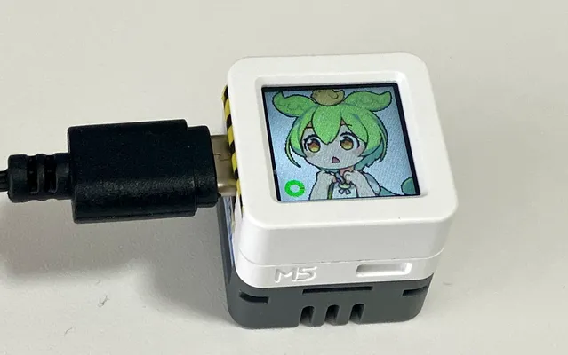

# 30分おきにずんだもんが休憩に誘うデバイス for M5Stack ATOMS3 (Atomic Echo Base使用)

## これは何？
30分おきに休憩を促す音声を再生するデバイスです。働きすぎを防止して気分転換を図るのが狙いです。腰痛防止にもいいのだ。

これは [ToFセンサーバージョン](https://github.com/kaz-mac/zundabreak2) のToF使用しないバージョンです。AtomS3とAtomic Echo Baseだけで作れます。

## 必要なもの
* M5Stack [ATOMS3](https://shop.m5stack.com/products/atoms3-dev-kit-w-0-85-inch-screen)
* M5Stack [Atomic Echo Base](https://shop.m5stack.com/products/atomic-echo-base-with-microphone-and-speaker)

## 作り方

### 必要なライブラリ
* M5Unified
* ESP8266Audio
* M5Atomic-EchoBase
* Ticker

## ボタン操作
短押し ... 中断・再開（中断中は頭にアヒルちゃんが乗ってます） 
長押し ... 次の状態へ遷移
 

## カスタマイズ
時間設定、音声、表情、キャラクターを変えたい場合は [ToFセンサーバージョン](https://github.com/kaz-mac/zundabreak2) を参考にしてください。

## License
個別に表記しているものを除き、プログラムは[MIT license](https://opensource.org/licenses/MIT)です。 
音声データ、画像データ、およびキャラクターに関してはライセンス・利用規約が異なります。

[東北ずん子ずんだもんプロジェクト　キャラクター　利用の手引き](https://zunko.jp/guideline.html) 
[ずんだもん立ち絵素材](https://www.pixiv.net/artworks/92641351) 
[VOICEVOX ソフトウェア利用規約](https://voicevox.hiroshiba.jp/term/) 

## Credit
* 画像データ 坂本アヒルさん
* キャラクター 東北ずん子ずんだもんプロジェクト
* 音声データ VOICEVOX: ずんだもん
